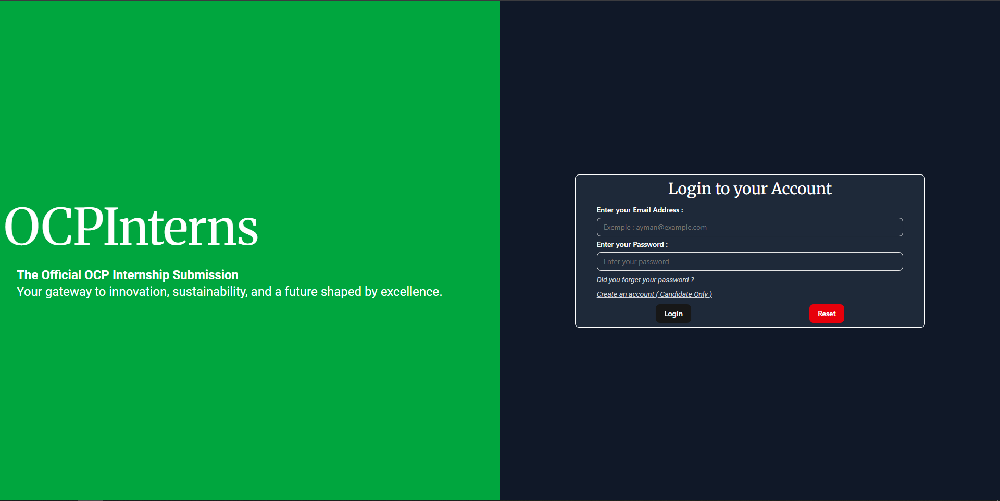

# 🚀 OCP Internship Management System

## Overview

A comprehensive, enterprise-grade internship management platform designed for OCP Group that revolutionizes the way organizations handle internship programs. This scalable full-stack application delivers an intuitive user experience through responsive design, enabling seamless coordination between candidates, recruiters, mentors, and administrators. Built with modern web technologies and microservices principles, the platform ensures robust performance while maintaining exceptional usability across all devices.

## ✨ Key Features

### 🎯 **Multi-Role Management**
- **Candidate Portal**: Application submission, status tracking, and document download
- **Recruiter Dashboard**: Application review, candidate evaluation, and bulk operations
- **Mentor Interface**: Mentee management, progress tracking, and location coordination
- **Admin Control Panel**: User management, system analytics, and location administration

### 📊 **Advanced Analytics & Reporting**
- Real-time dashboard with interactive charts and KPIs
- Application trend analysis and performance metrics
- Department-wise distribution and mentor workload tracking
- Comprehensive reporting with data export capabilities

### 📄 **Document Management**
- Dynamic PDF generation with official OCP letterhead
- QR code verification system for document authenticity
- Automated letter creation with application-specific details
- Secure document download with access control

### 🔐 **Enterprise Security**
- JWT-based authentication with refresh token rotation
- Role-based access control (RBAC) with granular permissions
- Input validation and sanitization across all endpoints
- Secure file handling and data encryption

### 🎨 **Modern User Experience**
- Responsive design optimized for desktop, tablet, and mobile
- Dark/light theme support with accessibility compliance
- Intuitive navigation with contextual user interfaces
- Real-time notifications and feedback systems

## 🏗️ Technical Highlights

### **Modular Architecture**
- **Frontend**: React 18 with Vite for lightning-fast development and optimized builds
- **Backend**: Express.js with modular route handlers and middleware composition
- **Database**: MongoDB with Mongoose ODM for flexible document modeling
- **Authentication**: JWT with secure refresh token mechanism

### **Microservices Principles**
- Separation of concerns with dedicated handlers for each business domain
- Loosely coupled components enabling independent scaling and deployment
- API-first design with RESTful endpoints following OpenAPI specifications
- Event-driven architecture with asynchronous processing capabilities

### **Robust State Management**
- React Context API for global state management with optimized re-rendering
- Custom hooks for encapsulating business logic and API interactions
- Optimistic UI updates with error boundary handling
- Persistent state management with automatic data synchronization

### **Advanced Database Design**
- Normalized schema design with embedded documents for optimal performance
- Composite indexes for efficient querying and data retrieval
- Aggregation pipelines for complex analytics and reporting
- Data validation at both application and database levels

### **Containerization Ready**
- Docker-compatible project structure with environment-specific configurations
- Modular build system supporting multi-stage deployments
- Environment variable management for seamless DevOps integration
- Scalable architecture supporting horizontal and vertical scaling


## 🚀 Getting Started

### Prerequisites
- Node.js (v18.0.0 or higher)
- MongoDB (v5.0.0 or higher)
- Git

### Installation

1. **Clone the repository**
   ```bash
   git clone https://github.com/eayzaid/OCPinterns.git
   cd OCPinterns
   ```

2. **Backend Setup**
   ```bash
   cd OCPInternsBackEnd
   npm install
   ```

3. **Frontend Setup**
   ```bash
   cd ../OCPInternsFrontEnd
   npm install
   ```

4. **Environment Configuration**
   
   **Backend Environment (.env)**
   ```bash
   cd OCPInternsBackEnd
   
   # Create .env file with the following variables:
   API_PORT=8080
   MONGODB_URI=YOUR_MONGODB_CONNECTION_STRING
   SECRET_JWT_KEY=YOUR_JWT_SECRET_KEY
   REFRESH_JWT_KEY=YOUR_REFRESH_TOKEN_SECRET_KEY
   WEB_APP_URL=http://localhost:5173
   ```
   
   **Frontend Environment (.env)**
   ```bash
   cd OCPInternsFrontEnd
   
   # Create .env file with the following variables:
   VITE_BACK_END_API_URL=http://localhost:8080
   ```

6. **Run the Application**
   ```bash
   # Terminal 1 - Backend
   cd OCPInternsBackEnd
   npm start
   
   # Terminal 2 - Frontend
   cd OCPInternsFrontEnd
   npm run dev
   ```

7. **Access the Application**
   - Frontend: `http://localhost:5173`
   - Backend API: `http://localhost:API_PORT`

## 🎨 User Interface

> **Note**: Some screenshots may show black residue below the sidebar due to the screenshot capture program used. In actual usage, the page overflows vertically and the sidebar maintains its sticky positioning for optimal user experience.

### Authentication & User Verification

*Comprehensive authentication system with role-based login and secure user verification*


*Document verification interface for unverified users with clear guidance and security indicators*


*Verified user interface displaying successful authentication and document validation status*

### Administrative Dashboard & Analytics

*Comprehensive administrative dashboard featuring real-time analytics, KPI tracking, and system overview with interactive charts*

### Application Management System

*Advanced application management system for efficient candidate review*


*Intuitive application submission interface with comprehensive form validation and user-friendly design*


*Candidate application tracking interface displaying submission history, status updates, and document access*

### Location & Resource Management

*Comprehensive location management system for organizing departments, sub-departments*

### Human Resource Management

*Mentor management interface featuring mentor profiles, and mentee assignment counter*


*Recruiter management dashboard*

## 🛠️ Built With

### Frontend Technologies
- **React 18** - Modern UI library with concurrent features
- **Vite** - Lightning-fast build tool and development server
- **Tailwind CSS** - Utility-first CSS framework
- **shadcn/ui** - High-quality accessible component library
- **React Hook Form** - Performant forms with easy validation
- **Recharts** - Composable charting library for React

### Backend Technologies
- **Express.js** - Fast, unopinionated web framework
- **MongoDB** - Flexible, document-based database
- **Mongoose** - Elegant MongoDB object modeling
- **JWT** - Secure authentication and authorization
- **PDF-lib** - Advanced PDF generation and manipulation
- **QRCode** - QR code generation for document verification

### Development Tools
- **ESLint** - Code quality and consistency
- **Prettier** - Code formatting
- **Git** - Version control
- **Postman** - API testing and documentation

## 📈 Performance & Scalability

- **Database Optimization**: Indexed queries with sub-100ms response times
- **Caching Strategy**: Redis-ready architecture for session management
- **Bundle Optimization**: Code splitting and lazy loading implementation
- **API Rate Limiting**: Protection against abuse and DOS attacks
- **Error Handling**: Comprehensive error boundaries and logging

## 🔒 Security Features

- **Authentication**: JWT with secure refresh token rotation
- **Authorization**: Role-based access control with granular permissions
- **Data Validation**: Input sanitization and schema validation
- **CORS Protection**: Configured cross-origin resource sharing
- **Security Headers**: Implementation of security best practices

## 📝 License

This project is licensed under the MIT License - see the [LICENSE](LICENSE) file for details.

## 👨‍💻 Author

**Zaidane Ayman**
- GitHub: [@eayzaid](https://github.com/eayzaid)
- LinkedIn: [Your LinkedIn Profile](https://www.linkedin.com/in/zaidane-ayman/)
- Email: aymanzaidanepro@gmail.com

---

⭐ **Star this repository if you found it helpful!**
